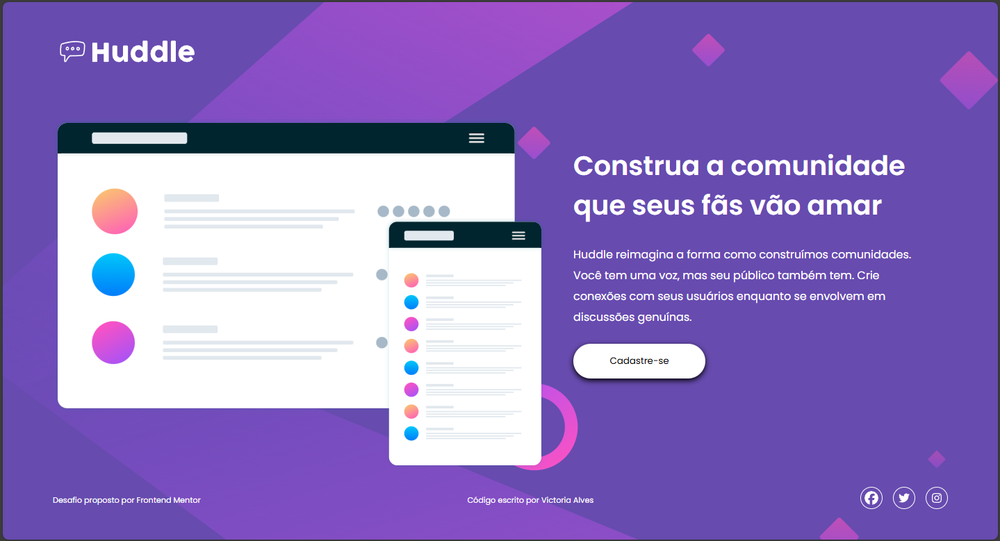
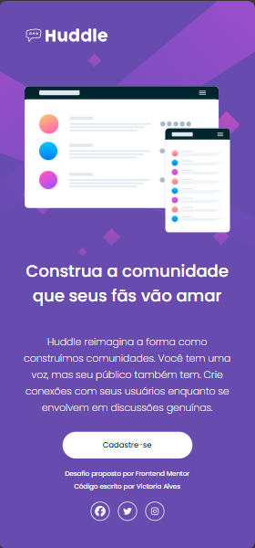

## Quest #1 - Landing Page da Huddle

Este projeto é um desafio de [Frontend Mentor](https://www.frontendmentor.io?ref=challenge). A tarefa consistia em construir o layout de uma *landing page* com design responsivo utilizando HTML e CSS.

## Objetivo do Desafio

Foi proposto a replicação do design do site Huddle, garantindo a exibição da página em telas mobile e desktop, com o foco principal em:

* **HTML Semântico:** Trazendo elementos da linguagem que sejam adequados para cada seção da página.
* **Layout Responsivo:** Adaptando sua apresentação para diferentes exibições.
* **CSS Avançado:** Aplicação de ferramentas como Flexbox, além da utilização de variáveis, Media Queries e pseudo-classes

## Tecnologias Utilizadas

| Tecnologia | Finalidade |
| :---: | :---: |
| **HTML5** | Estruturação da página. |
| **CSS3** | Estilização, Flexbox e Media Queries. |
| **SVG** | Gráficos vetoriais para ícones e planos de fundo. |
| **Google Fonts** | Importação da fonte **Poppins**. |
| **Font Awesome** | Importação dos ícones de redes sociais. |

## Screenshots

| Desktop | Mobile |
| :---: | :---: |
|  |  |

## Links

* **Live Site URL:** [Adicionar o link da sua página hospedada (GitHub Pages, Vercel, Netlify, etc.)]
* **Repositório (Código Fonte):** https://github.com/vickie-alves/quest1-huddle-landing-page

## Autor

* **Frontend Mentor:** [@vickie-alves](https://www.frontendmentor.io/profile/vickie-alves)
* **GitHub:** [Victoria Alves](https://github.com/vickie-alves)